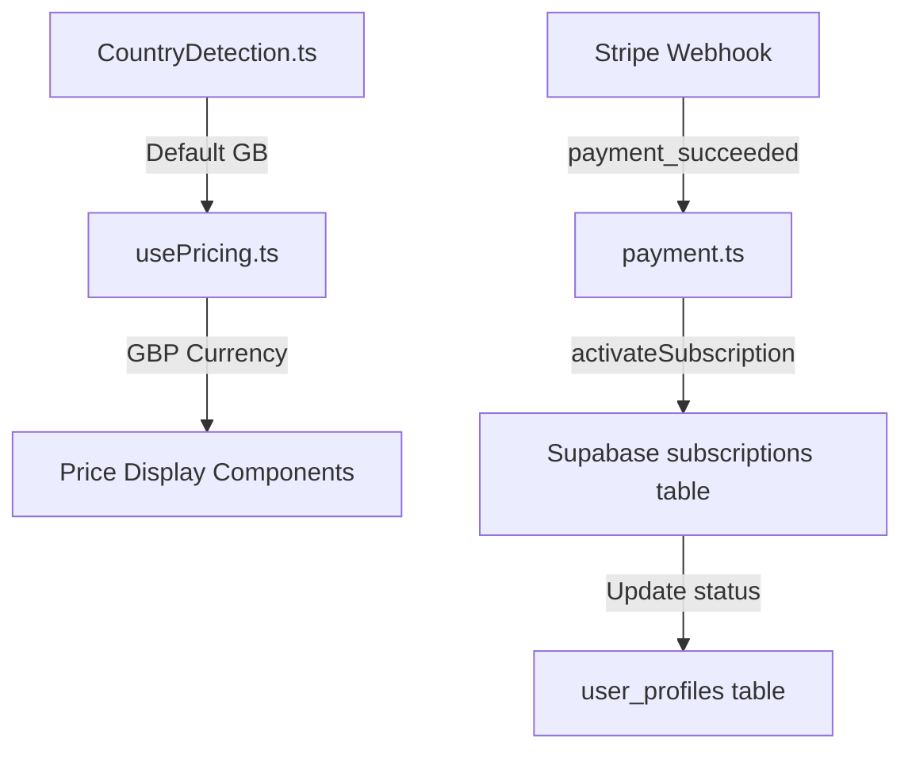

# Design Document: Currency and Subscription Fix

## Overview

This design addresses two critical issues in the Jeeva Admin Portal:

1. Changing the default currency from USD to GBP across the application
2. Implementing proper subscription activation after successful payment

The changes are minimal and focused on fixing the existing code rather than introducing new architecture.

## Architecture

The fix involves modifications to three main areas:



### Currency Flow

- `CountryDetection.ts` - Change default country from 'US' to 'GB'
- `usePricing.ts` - Update default countryCode from 'US' to 'GB'
- `currency.ts` - Update fallback currency to 'gbp'

### Subscription Activation Flow

- `payment.ts` - Implement actual subscription activation logic in `activateSubscription()`
- Create/update subscription record with proper dates
- Update user_profiles subscription_status

## Components and Interfaces

### Modified Files

#### 1. CountryDetection.ts

- Change `setDefaultCountry()` to use 'GB' instead of 'US'
- Update default currency to 'gbp' and symbol to '£'

#### 2. hooks/usePricing.ts

- Change default countryCode from 'US' to 'GB'

#### 3. utils/currency.ts

- Update fallback currency in `formatForPaymentIntent()` to 'GBP'

#### 4. server/services/payment.ts

- Implement `activateSubscription()` to actually update the database:
  - Query subscription plan to get billing cycle
  - Calculate end_date based on billing cycle
  - Update subscription status to 'active'
  - Update last_payment_date and next_payment_date
  - Update user_profiles subscription_status

### Interface Changes

```typescript
// No new interfaces needed - using existing types

// Subscription activation will use existing subscriptions table schema:
interface SubscriptionUpdate {
  status: "active" | "trial" | "expired" | "cancelled";
  start_date: string;
  end_date: string;
  last_payment_date: string;
  next_payment_date?: string;
}
```

## Data Models

### Existing Tables Used

#### subscriptions

- `id` (uuid)
- `user_id` (uuid)
- `plan_id` (uuid)
- `status` (text) - 'active', 'trial', 'expired', 'cancelled'
- `start_date` (timestamp)
- `end_date` (timestamp)
- `last_payment_date` (timestamp)
- `next_payment_date` (timestamp)
- `auto_renew` (boolean)

#### user_profiles

- `user_id` (uuid)
- `subscription_status` (text) - mirrors subscription status

#### subscription_plans

- `id` (uuid)
- `billing_cycle` (text) - 'monthly', 'yearly', 'lifetime'

## Correctness Properties

_A property is a characteristic or behavior that should hold true across all valid executions of a system-essentially, a formal statement about what the system should do. Properties serve as the bridge between human-readable specifications and machine-verifiable correctness guarantees._

### Property 1: Default Currency is GBP

_For any_ call to CountryDetection utilities without explicit country context, the returned currency SHALL be 'gbp' and the symbol SHALL be '£'.
**Validates: Requirements 1.1, 1.2, 1.4**

### Property 2: Default Country Code is GB

_For any_ initialization of pricing utilities without detected country data, the default country code SHALL be 'GB'.
**Validates: Requirements 1.3**

### Property 3: Subscription Activation Updates Status

_For any_ valid subscription ID passed to activateSubscription, the subscription record's status SHALL be updated to 'active'.
**Validates: Requirements 2.1**

### Property 4: End Date Calculation Correctness

_For any_ subscription activation with a known billing cycle, the end_date SHALL equal start_date plus the billing cycle duration (30 days for monthly, 365 days for yearly).
**Validates: Requirements 2.3**

### Property 5: Payment-Subscription Linkage

_For any_ successful payment, the payment record SHALL have a valid subscription_id linking to an existing subscription.
**Validates: Requirements 3.1**

### Property 6: Payment Date Updates

_For any_ successful payment, the linked subscription's last_payment_date SHALL be updated to the payment completion timestamp.
**Validates: Requirements 3.2**

## Error Handling

### Currency Detection Failure

- If country detection API fails, default to GB/GBP
- Log the error but don't block the user experience

### Subscription Activation Failure

- If subscription update fails, log the error with full context
- Payment status should still be marked as succeeded (payment was processed)
- Admin should be notified of orphaned payments without activated subscriptions

### Missing Subscription Plan

- If subscription_plan_id doesn't exist, log error and skip date calculation
- Use default 30-day period as fallback

## Testing Strategy

### Unit Tests

- Test `setDefaultCountry()` returns GB/GBP values
- Test `formatPrice()` without country returns £ symbol
- Test `activateSubscription()` updates database correctly
- Test end_date calculation for different billing cycles

### Property-Based Tests

Using Vitest with fast-check for property-based testing:

1. **Default Currency Property Test**
   - Generate random price values
   - Verify formatPrice without country always returns £ prefix

2. **End Date Calculation Property Test**
   - Generate random start dates and billing cycles
   - Verify end_date is always start_date + correct duration

3. **Subscription Activation Property Test**
   - Generate random subscription IDs
   - Verify status is always 'active' after activation

### Integration Tests

- Test full payment flow from Stripe webhook to subscription activation
- Verify user_profiles is updated after subscription activation
