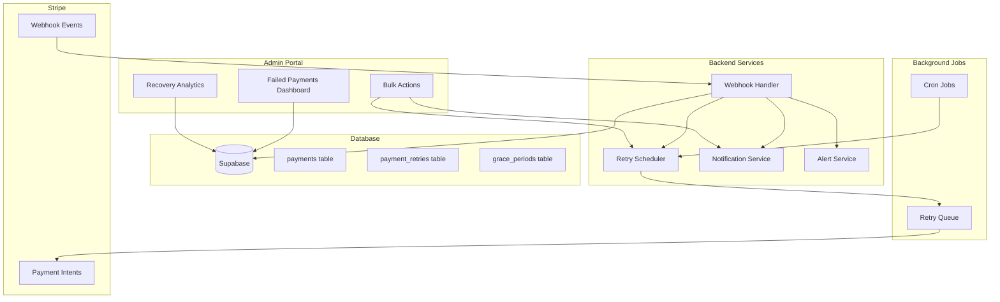
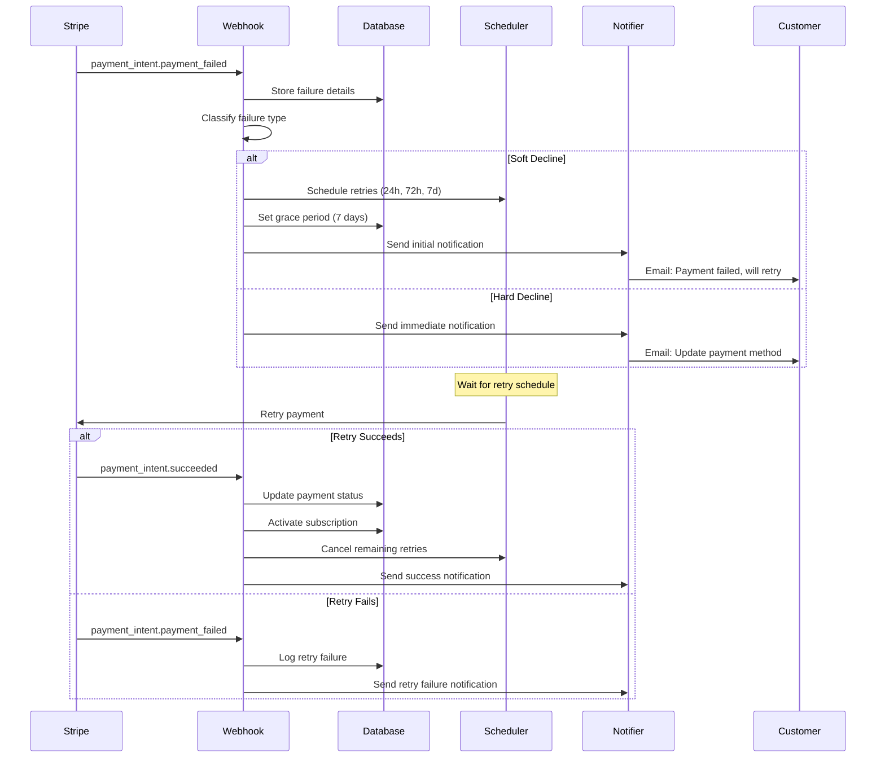

# Design Document: Failed Payments & Dunning Management

## Overview

This design document outlines the implementation of a Failed Payments & Dunning Management system for the Jeeva Admin Portal. The system provides:

1. Centralized dashboard for viewing and managing failed payments
2. Automatic classification of payment failures (soft vs hard declines)
3. Manual and automated retry logic with configurable schedules
4. Customer notification system for payment failures
5. Grace period management to prevent immediate service interruption
6. Recovery analytics and reporting
7. Bulk action capabilities for efficient management
8. Real-time webhook integration with Stripe
9. Admin alerting for critical failures
10. Payment method update tracking

The key architectural principle is to maximize revenue recovery while minimizing customer friction and administrative overhead.

## Architecture



### Payment Failure Flow



## Components and Interfaces

### 1. Failed Payments Service

**Location:** `server/services/failedPayments.ts`

```typescript
interface FailedPaymentFilters {
  failureType?: 'soft_decline' | 'hard_decline'
  dateFrom?: string
  dateTo?: string
  searchQuery?: string
  status?: 'pending_retry' | 'retrying' | 'recovered' | 'permanently_failed'
}

interface FailedPayment {
  id: string
  userId: string
  userEmail: string
  amount: number
  currency: string
  failureReason: string
  failureCode: string
  failureType: 'soft_decline' | 'hard_decline'
  failureDate: string
  retryCount: number
  nextRetryDate?: string
  status: string
  gracePeriodEndsAt?: string
  lastRetryDate?: string
  recoveredAt?: string
}

interface FailedPaymentsService {
  getFailedPayments(filters: FailedPaymentFilters): Promise<FailedPayment[]>
  classifyFailure(errorCode: string): 'soft_decline' | 'hard_decline'
  retryPayment(paymentId: string, adminUserId: string): Promise<RetryResult>
  getRetryHistory(paymentId: string): Promise<RetryAttempt[]>
  bulkRetry(paymentIds: string[]): Promise<BulkRetryResult>
}
```

### 2. Retry Scheduler Service

**Location:** `server/services/retryScheduler.ts`

```typescript
interface RetrySchedule {
  paymentId: string
  attemptNumber: number
  scheduledFor: Date
  status: 'pending' | 'completed' | 'cancelled'
}

interface RetrySchedulerService {
  scheduleRetries(paymentId: string, failureType: string): Promise<RetrySchedule[]>
  cancelScheduledRetries(paymentId: string): Promise<void>
  processScheduledRetries(): Promise<void>
  getNextRetryDate(paymentId: string): Promise<Date | null>
}
```

### 3. Notification Service

**Location:** `server/services/notifications.ts`

```typescript
interface PaymentFailureNotification {
  userId: string
  userEmail: string
  paymentId: string
  amount: number
  currency: string
  failureReason: string
  updatePaymentUrl: string
  retrySchedule?: Date[]
}

interface NotificationService {
  sendPaymentFailureNotification(data: PaymentFailureNotification): Promise<void>
  sendRetryFailureNotification(data: PaymentFailureNotification): Promise<void>
  sendFinalNotice(data: PaymentFailureNotification): Promise<void>
  sendCustomNotification(paymentId: string, message: string): Promise<void>
}
```

### 4. Grace Period Service

**Location:** `server/services/gracePeriod.ts`

```typescript
interface GracePeriod {
  paymentId: string
  subscriptionId: string
  startDate: Date
  endDate: Date
  daysRemaining: number
  status: 'active' | 'expired' | 'cancelled'
}

interface GracePeriodService {
  createGracePeriod(paymentId: string, durationDays: number): Promise<GracePeriod>
  getGracePeriod(paymentId: string): Promise<GracePeriod | null>
  extendGracePeriod(paymentId: string, additionalDays: number): Promise<GracePeriod>
  cancelGracePeriod(paymentId: string): Promise<void>
  processExpiredGracePeriods(): Promise<void>
}
```

### 5. Recovery Analytics Service

**Location:** `server/services/recoveryAnalytics.ts`

```typescript
interface RecoveryStats {
  totalFailedPayments: number
  recoveredPayments: number
  permanentlyFailedPayments: number
  overallRecoveryRate: number
  recoveryByAttempt: {
    attemptNumber: number
    recoveryRate: number
    count: number
  }[]
  recoveryByFailureType: {
    failureType: string
    recoveryRate: number
    count: number
  }[]
  totalRevenueRecovered: number
  averageTimeToRecovery: number // in hours
}

interface RecoveryAnalyticsService {
  getRecoveryStats(dateFrom: string, dateTo: string): Promise<RecoveryStats>
  getRecoveryTrends(period: 'daily' | 'weekly' | 'monthly'): Promise<TrendData[]>
}
```

### 6. Alert Service

**Location:** `server/services/alerts.ts`

```typescript
interface AlertConfig {
  highValueThreshold: number // Amount in GBP
  dailyFailureRateThreshold: number // Percentage
  consecutiveFailureThreshold: number
  adminEmails: string[]
}

interface AlertService {
  sendHighValueFailureAlert(payment: FailedPayment): Promise<void>
  sendFraudAlert(payment: FailedPayment): Promise<void>
  sendHighFailureRateAlert(rate: number): Promise<void>
  sendConsecutiveFailureAlert(userId: string, count: number): Promise<void>
  updateAlertConfig(config: Partial<AlertConfig>): Promise<void>
}
```

## Data Models

### Enhanced Payment Record

```typescript
interface Payment {
  // Existing fields...
  
  // Failure tracking fields (new)
  failureCode?: string              // Stripe error code
  failureMessage?: string            // Human-readable failure reason
  failureType?: 'soft_decline' | 'hard_decline'
  failedAt?: string                  // Timestamp of failure
  retryCount: number                 // Number of retry attempts
  lastRetryAt?: string               // Timestamp of last retry
  nextRetryAt?: string               // Timestamp of next scheduled retry
  recoveredAt?: string               // Timestamp when payment was recovered
  permanentlyFailedAt?: string       // Timestamp when marked as permanently failed
  reviewedBy?: string                // Admin user ID who reviewed
  reviewedAt?: string                // Timestamp of review
}
```

### Payment Retry Record

```typescript
interface PaymentRetry {
  id: string
  paymentId: string
  attemptNumber: number
  retryType: 'manual' | 'automated'
  scheduledFor: string
  attemptedAt?: string
  status: 'pending' | 'processing' | 'succeeded' | 'failed' | 'cancelled'
  failureCode?: string
  failureMessage?: string
  triggeredBy?: string              // Admin user ID for manual retries
  createdAt: string
  updatedAt: string
}
```

### Grace Period Record

```typescript
interface GracePeriodRecord {
  id: string
  paymentId: string
  subscriptionId: string
  userId: string
  startDate: string
  endDate: string
  durationDays: number
  status: 'active' | 'expired' | 'cancelled'
  cancelledAt?: string
  cancelledBy?: string              // Admin user ID
  createdAt: string
  updatedAt: string
}
```

### Alert Log

```typescript
interface AlertLog {
  id: string
  alertType: 'high_value' | 'fraud' | 'high_failure_rate' | 'consecutive_failure'
  paymentId?: string
  userId?: string
  severity: 'low' | 'medium' | 'high' | 'critical'
  message: string
  metadata: Record<string, any>
  sentTo: string[]                  // Admin email addresses
  sentAt: string
  acknowledgedBy?: string
  acknowledgedAt?: string
  createdAt: string
}
```

## Correctness Properties

*A property is a characteristic or behavior that should hold true across all valid executions of a system-essentially, a formal statement about what the system should do. Properties serve as the bridge between human-readable specifications and machine-verifiable correctness guarantees.*

### Property 1: Failed Payments Ordering
*For any* set of failed payments, when retrieved without filters, the list should be ordered by failure date in descending order (most recent first).
**Validates: Requirements 1.1**

### Property 2: Failed Payment Completeness
*For any* failed payment record, the record should contain all required fields: payment ID, user email, amount, currency, failure reason, failure date, and retry status.
**Validates: Requirements 1.2**

### Property 3: Failure Classification Consistency
*For any* Stripe error code, the classification function should consistently return either "soft_decline" or "hard_decline", and the classification should match the predefined mapping (insufficient_funds → soft, expired_card → hard, etc.).
**Validates: Requirements 1.3, 2.1-2.5**

### Property 4: Date Range Filtering
*For any* date range filter applied to failed payments, all returned payments should have failure dates that fall within the specified range (inclusive).
**Validates: Requirements 1.4**

### Property 5: Search Result Matching
*For any* search query (email or payment ID), all returned results should contain the search term in either the user email or payment ID field.
**Validates: Requirements 1.5**

### Property 6: Manual Retry Invocation
*For any* failed payment, when manual retry is triggered, the system should attempt to re-process the payment by calling the Stripe payment API with the stored payment method ID.
**Validates: Requirements 3.1**

### Property 7: Successful Retry State Transition
*For any* payment retry that succeeds, the payment status should transition to "succeeded" and the associated subscription should transition to "active" status.
**Validates: Requirements 3.2**

### Property 8: Failed Retry Logging
*For any* payment retry that fails, the retry count should increment by exactly 1 and a new retry record should be created with the failure reason.
**Validates: Requirements 3.3**

### Property 9: Retry Audit Trail
*For any* manual retry attempt, the payment metadata should contain the admin user ID and a timestamp recorded at the time of retry.
**Validates: Requirements 3.4**

### Property 10: Soft Decline Retry Scheduling
*For any* payment that fails with a soft decline classification, exactly 3 retry attempts should be scheduled at 24 hours, 72 hours, and 7 days after the initial failure.
**Validates: Requirements 4.1**

### Property 11: Hard Decline No Retry
*For any* payment that fails with a hard decline classification, zero retry attempts should be scheduled.
**Validates: Requirements 4.2**

### Property 12: Successful Retry Cleanup
*For any* automated retry that succeeds, the payment status should update to "succeeded", the subscription should activate, and all remaining scheduled retries should be cancelled.
**Validates: Requirements 4.3**

### Property 13: Failed Retry Continuation
*For any* automated retry that fails, a retry record should be created with the failure details and the next scheduled retry should remain in "pending" status.
**Validates: Requirements 4.4**

### Property 14: Exhausted Retries Final State
*For any* payment where all scheduled retries have been attempted and failed, the payment status should be "permanently_failed" and an admin notification should be sent.
**Validates: Requirements 4.5**

### Property 15: Retry History Completeness
*For any* payment with retry attempts, the retry history should contain exactly one record for each retry attempt, ordered by attempt date.
**Validates: Requirements 5.1**

### Property 16: Retry Type Tracking
*For any* retry record, the record should have a retry_type field that is either "manual" or "automated".
**Validates: Requirements 5.2**

### Property 17: Failed Retry Reason Preservation
*For any* retry attempt that fails, the retry record should contain a non-null failure_reason field.
**Validates: Requirements 5.3**

### Property 18: Next Retry Visibility
*For any* payment with scheduled retries, the next_retry_date field should equal the scheduled_for date of the earliest pending retry.
**Validates: Requirements 5.4**

### Property 19: Retry Statistics Accuracy
*For any* payment, the retry statistics (total retries, successful retries, remaining scheduled retries) should equal the count of retry records grouped by status.
**Validates: Requirements 5.5**

### Property 20: Initial Notification Timing
*For any* payment failure, a notification job should be created with a scheduled time within 1 hour of the failure timestamp.
**Validates: Requirements 6.1**

### Property 21: Notification Content Completeness
*For any* payment failure notification, the email content should include the failure reason, amount due, and a payment update URL.
**Validates: Requirements 6.2**

### Property 22: Retry Failure Notification
*For any* retry attempt that fails, a notification should be sent to the customer.
**Validates: Requirements 6.3**

### Property 23: Final Notice on Exhaustion
*For any* payment where all retries are exhausted, a final notice notification should be sent indicating service suspension.
**Validates: Requirements 6.5**

### Property 24: Grace Period Activation
*For any* payment failure, a grace period record should be created with an end date equal to the failure date plus the configured grace period duration (default 7 days).
**Validates: Requirements 7.1**

### Property 25: Grace Period Expiration Suspension
*For any* grace period that expires without payment recovery, the associated subscription status should transition to "suspended".
**Validates: Requirements 7.2**

### Property 26: Grace Period Days Calculation
*For any* active grace period, the days_remaining calculation should equal the difference between the end date and the current date, rounded down.
**Validates: Requirements 7.3**

### Property 27: Grace Period Extension on Recovery
*For any* payment recovered during an active grace period, the subscription end date should be extended by the grace period duration.
**Validates: Requirements 7.4**

### Property 28: Manual Grace Period Adjustment
*For any* manual adjustment to a grace period, the subscription suspension date should be recalculated based on the new grace period end date.
**Validates: Requirements 7.5**

### Property 29: Overall Recovery Rate Calculation
*For any* set of failed payments, the overall recovery rate should equal (recovered_count / total_failed_count) * 100.
**Validates: Requirements 8.1**

### Property 30: Recovery Rate by Attempt
*For any* retry attempt number, the recovery rate should equal (successful_retries_at_attempt / total_retries_at_attempt) * 100.
**Validates: Requirements 8.2**

### Property 31: Recovery Rate by Failure Type
*For any* failure type (soft/hard), the recovery rate should equal (recovered_payments_of_type / total_failed_payments_of_type) * 100.
**Validates: Requirements 8.3**

### Property 32: Total Revenue Recovered
*For any* date range, the total revenue recovered should equal the sum of all payment amounts where status is "succeeded" and recovered_at falls within the range.
**Validates: Requirements 8.4**

### Property 33: Average Time to Recovery
*For any* set of recovered payments, the average time to recovery should equal the mean of (recovered_at - failed_at) for all recovered payments.
**Validates: Requirements 8.5**

### Property 34: Bulk Retry Completeness
*For any* set of selected payment IDs, when bulk retry is executed, a retry attempt should be made for each payment ID in the set.
**Validates: Requirements 9.2**

### Property 35: Bulk Notification Completeness
*For any* set of selected payment IDs, when bulk send notifications is executed, a notification should be sent to the customer associated with each payment.
**Validates: Requirements 9.3**

### Property 36: Bulk Review Flag
*For any* set of selected payment IDs, when bulk mark as reviewed is executed, all payments should have reviewed_by and reviewed_at fields populated.
**Validates: Requirements 9.4**

### Property 37: Webhook Failure Extraction
*For any* payment_intent.payment_failed webhook, the failure code and failure message should be extracted from the webhook payload and stored in the payments table.
**Validates: Requirements 10.1**

### Property 38: Charge Failed Webhook Processing
*For any* charge.failed webhook, the payment record should be updated with the failure details from the webhook payload.
**Validates: Requirements 10.2**

### Property 39: Webhook Triggers Retry Scheduling
*For any* payment failure webhook processed, if the failure is classified as soft decline, retry jobs should be created.
**Validates: Requirements 10.3**

### Property 40: Webhook Triggers Initial Notification
*For any* payment failure webhook processed, an initial customer notification should be scheduled.
**Validates: Requirements 10.4**

### Property 41: Webhook Retry on Failure
*For any* webhook processing that fails, the system should log the error and retry processing up to 3 times.
**Validates: Requirements 10.5**

### Property 42: High Value Alert Threshold
*For any* payment failure where the amount exceeds the configured high value threshold (default £100), an alert should be sent to admin users.
**Validates: Requirements 11.1**

### Property 43: Daily Failure Rate Alert
*For any* day where the failure rate (failed_payments / total_payments) exceeds the configured threshold (default 10%), an alert should be sent to admin users.
**Validates: Requirements 11.3**

### Property 44: Consecutive Failure Alert
*For any* user with 3 consecutive payment failures, an alert should be sent to admin users.
**Validates: Requirements 11.4**

### Property 45: Custom Alert Threshold Application
*For any* configured alert threshold, alerts should be triggered based on the custom threshold value rather than the default value.
**Validates: Requirements 11.5**

### Property 46: Payment Method Update Timestamp
*For any* payment method update, the payment_customers table should have an updated_at timestamp recorded at the time of update.
**Validates: Requirements 12.1**

### Property 47: Payment Method Update Indicator
*For any* failed payment, if the customer's payment method updated_at timestamp is after the payment failed_at timestamp, the UI should indicate the payment method has been updated.
**Validates: Requirements 12.2**

### Property 48: Auto Retry on Payment Method Update
*For any* payment method update that occurs after a payment failure, a retry attempt should be scheduled within 1 hour of the update.
**Validates: Requirements 12.3**

### Property 49: Payment Method Update Recovery Rate
*For any* set of failed payments, the percentage of customers who updated payment methods should equal (customers_who_updated / total_customers_with_failures) * 100.
**Validates: Requirements 12.4**

### Property 50: Grace Period Cancellation on Update
*For any* payment method update, if an active grace period exists for a failed payment, the grace period status should transition to "cancelled".
**Validates: Requirements 12.5**

## Error Handling

### API Errors

| Error Code | Scenario | Response |
|------------|----------|----------|
| 400 | Invalid payment ID | `{ error: "Payment not found or invalid" }` |
| 400 | Payment not in failed state | `{ error: "Payment is not in a failed state" }` |
| 400 | Retry limit exceeded | `{ error: "Maximum retry attempts exceeded" }` |
| 403 | Insufficient permissions | `{ error: "Admin permissions required" }` |
| 500 | Stripe API failure | `{ error: "Payment service unavailable. Please try again." }` |
| 500 | Notification service failure | `{ error: "Failed to send notification" }` |

### Webhook Errors

- **Invalid webhook signature:** Return 400, log error, do not process
- **Missing required fields:** Log warning, process with available data, flag for review
- **Database write failure:** Return 500 to Stripe (triggers retry), log error with full payload
- **Retry scheduling failure:** Log error, create manual review task for admin

### Graceful Degradation

- If notification service is down, queue notifications for later delivery
- If retry scheduling fails, create a manual review task
- If grace period creation fails, default to immediate suspension with admin alert

## Testing Strategy

### Unit Testing

Unit tests will cover:
- Failure classification logic (error code mapping)
- Retry scheduling calculations (24h, 72h, 7d intervals)
- Grace period date calculations
- Recovery rate calculations
- Alert threshold logic
- Bulk action processing

### Property-Based Testing

The project will use **fast-check** as the property-based testing library for TypeScript.

Each property-based test will:
- Run a minimum of 100 iterations
- Be tagged with a comment referencing the correctness property: `**Feature: failed-payments-dunning, Property {number}: {property_text}**`
- Generate random but valid inputs to verify properties hold across all cases

Key property tests:
1. Failure classification is consistent for all error codes
2. Date range filtering returns only payments within range
3. Retry count increments correctly on each retry
4. Grace period calculations are mathematically correct
5. Recovery rate calculations sum to correct percentages
6. Bulk actions process all selected items

### Integration Testing

- End-to-end payment failure flow with Stripe test mode
- Webhook processing and retry scheduling
- Notification delivery
- Grace period expiration and subscription suspension
- Recovery analytics calculations against test data

