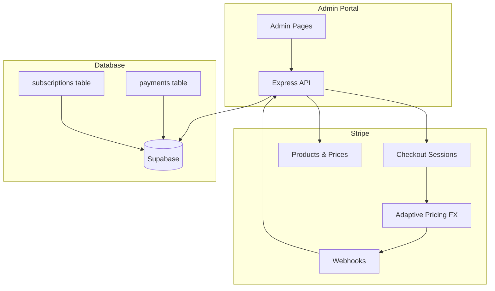
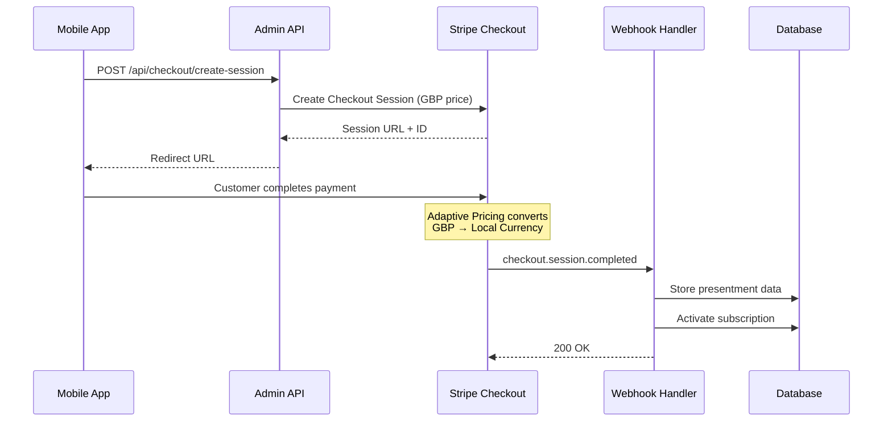

# Design Document: Stripe Adaptive Pricing Migration

## Overview

This design document outlines the migration of the Jeeva Admin Portal from a multi-currency price management system to Stripe Adaptive Pricing. The migration involves:

1. Replacing PaymentIntent-based payments with Stripe Checkout Sessions
2. Enforcing GBP-only price creation in the admin portal
3. Adding presentment analytics to track currency distribution
4. Enhancing payment and student displays with presentment data
5. Deprecating multi-currency management features

The key architectural shift is from "admin controls prices per currency" to "admin controls GBP catalog, Stripe handles FX automatically."

## Architecture



### Payment Flow (New)



## Components and Interfaces

### 1. Checkout Session Service

**Location:** `server/services/stripe.ts`

```typescript
interface CreateCheckoutSessionInput {
  priceIdGbp: string          // Stripe Price ID (GBP)
  userId: string              // Internal user ID
  customerEmail: string       // Customer email for Stripe
  successUrl: string          // Redirect on success
  cancelUrl: string           // Redirect on cancel
  metadata?: Record<string, string>
}

interface CheckoutSessionResult {
  sessionId: string           // cs_xxx
  sessionUrl: string          // Checkout page URL
}

// New method in stripeService
createCheckoutSession(input: CreateCheckoutSessionInput): Promise<CheckoutSessionResult>
```

### 2. Catalog API

**Endpoint:** `GET /api/stripe-admin/catalog`

```typescript
interface CatalogPlan {
  planId: string              // Internal plan ID
  name: string                // "Starter", "Growth", "Ultimate"
  description: string
  durationDays: number
  stripePriceIdGbp: string    // price_xxx
  unitAmountGbp: number       // Amount in pence (e.g., 2500 = £25.00)
  active: boolean
  features: string[]
}

interface CatalogResponse {
  plans: CatalogPlan[]
}
```

### 3. Presentment Analytics API

**Endpoint:** `GET /api/stripe-analytics/presentment-summary`

```typescript
interface PresentmentSummary {
  range: string               // "30d"
  totalPayments: number
  byCurrency: {
    currency: string          // "INR", "GBP", "USD"
    count: number
    percentage: number
    averageLocalAmount: number
    averageGbpAmount: number
    totalLocalAmount: number
    totalGbpAmount: number
  }[]
}
```

### 4. Webhook Handler Enhancement

**Event:** `checkout.session.completed`

```typescript
interface CheckoutSessionWebhookData {
  sessionId: string           // cs_xxx
  paymentIntentId: string     // pi_xxx
  chargeId: string            // ch_xxx
  customerId: string          // cus_xxx
  amountTotal: number         // Total in presentment currency (cents)
  currency: string            // Presentment currency (lowercase)
  amountSubtotal: number
  metadata: {
    userId: string
    subscriptionPlanId: string
  }
  // Adaptive Pricing fields
  currencyConversion?: {
    sourceCurrency: string    // "gbp"
    destinationCurrency: string // "inr"
    fxRate: number
    amountOriginal: number    // GBP amount in pence
  }
}
```

### 5. Enhanced Payment Record

**Database Schema Addition:**

```sql
ALTER TABLE payments ADD COLUMN IF NOT EXISTS stripe_checkout_session_id TEXT;
ALTER TABLE payments ADD COLUMN IF NOT EXISTS amount_charged_local DECIMAL(12,2);
ALTER TABLE payments ADD COLUMN IF NOT EXISTS currency_charged_local VARCHAR(3);
ALTER TABLE payments ADD COLUMN IF NOT EXISTS amount_charged_gbp DECIMAL(12,2);
ALTER TABLE payments ADD COLUMN IF NOT EXISTS fx_rate_applied DECIMAL(10,6);
ALTER TABLE payments ADD COLUMN IF NOT EXISTS country_detected VARCHAR(2);
```

## Data Models

### Payment Record (Enhanced)

```typescript
interface Payment {
  id: string
  userId: string
  gateway: 'stripe'
  
  // Existing fields
  stripePaymentIntentId?: string
  stripeCustomerId?: string
  
  // New Checkout Session fields
  stripeCheckoutSessionId?: string
  stripeChargeId?: string
  
  // Presentment fields (new)
  amountChargedLocal: number      // Amount in presentment currency
  currencyChargedLocal: string    // "INR", "GBP", "USD"
  amountChargedGbp: number        // Amount in GBP (settlement)
  fxRateApplied?: number          // FX rate used (local/gbp)
  countryDetected?: string        // Customer country code
  
  // Existing fields
  subscriptionId?: string
  subscriptionPlanId?: string
  status: PaymentStatus
  createdAt: string
  updatedAt: string
}
```

### Catalog Plan

```typescript
interface CatalogPlan {
  planId: string
  name: string
  description: string
  durationDays: number
  stripePriceIdGbp: string
  unitAmountGbp: number       // In pence
  active: boolean
  features: string[]
}
```

### Presentment Analytics

```typescript
interface CurrencyBreakdown {
  currency: string
  count: number
  percentage: number
  averageLocalAmount: number
  averageGbpAmount: number
  totalLocalAmount: number
  totalGbpAmount: number
}

interface PresentmentSummary {
  range: string
  totalPayments: number
  byCurrency: CurrencyBreakdown[]
}

interface CouponPresentment {
  couponId: string
  code: string
  redemptionsByCurrency: {
    currency: string
    count: number
  }[]
  totalRedemptions: number
}

interface RevenueByurrency {
  currency: string
  totalLocal: number
  totalGbp: number
  transactionCount: number
}
```

## Correctness Properties

*A property is a characteristic or behavior that should hold true across all valid executions of a system-essentially, a formal statement about what the system should do. Properties serve as the bridge between human-readable specifications and machine-verifiable correctness guarantees.*

### Property 1: GBP-Only Currency Validation
*For any* price creation request with a currency value, the system should accept the request if and only if the currency is "GBP" (case-insensitive), rejecting all other currency codes with an appropriate error.
**Validates: Requirements 1.1, 1.3**

### Property 2: Catalog Response Structure
*For any* catalog API response, each plan in the response should contain all required fields (planId, name, durationDays, stripePriceIdGbp, unitAmountGbp, active) and should not include country-based grouping.
**Validates: Requirements 1.2, 1.4, 7.3**

### Property 3: Checkout Session Configuration
*For any* checkout session creation request, the resulting Stripe session should include the GBP price ID, user metadata, success/cancel URLs, customer email, and allow_promotion_codes set to true.
**Validates: Requirements 2.1, 2.2, 2.5, 6.1**

### Property 4: Webhook Presentment Data Extraction
*For any* checkout.session.completed webhook payload containing currency conversion data, the system should correctly extract and store the presentment currency, local amount, GBP amount, and computed FX rate.
**Validates: Requirements 2.3, 4.4**

### Property 5: Subscription Activation on Webhook
*For any* successful checkout.session.completed webhook, the associated subscription should transition from 'pending' to 'active' status with correct start and end dates.
**Validates: Requirements 2.4**

### Property 6: Presentment Percentage Calculation
*For any* set of payment records with mixed currencies, the presentment summary should calculate percentages that sum to 100% and accurately reflect the distribution of payments by currency.
**Validates: Requirements 3.1**

### Property 7: Average Amount Calculation
*For any* set of payment records within a date range, the average presentment amount per currency should equal the sum of amounts divided by the count for that currency.
**Validates: Requirements 3.2**

### Property 8: Coupon Redemption Grouping
*For any* set of coupon redemptions with associated payment currencies, the analytics should correctly group and count redemptions by presentment currency.
**Validates: Requirements 3.4, 6.3**

### Property 9: Payment Record Presentment Fields
*For any* payment record stored from a Checkout Session, the record should contain stripe_checkout_session_id, stripe_payment_intent_id, amount_charged_local, currency_charged_local, amount_charged_gbp, and fx_rate_applied (when applicable).
**Validates: Requirements 4.1, 4.2, 4.4**

### Property 10: Student Payment Display
*For any* student with a completed payment, the student record should include the last payment currency and amount from the most recent successful payment.
**Validates: Requirements 5.1**

### Property 11: Coupon Eligibility Validation
*For any* coupon validation request, the system should check only eligibility criteria (plan applicability, active status, max_redemptions not exceeded) without validating against specific currency amounts.
**Validates: Requirements 6.2**

### Property 12: Revenue Analytics Completeness
*For any* revenue analytics query, the response should include both local currency totals and GBP equivalents for each presentment currency, with totals matching the sum of individual payment amounts.
**Validates: Requirements 9.1, 9.2**

## Error Handling

### API Errors

| Error Code | Scenario | Response |
|------------|----------|----------|
| 400 | Non-GBP currency in price creation | `{ error: "Only GBP prices are allowed. Adaptive Pricing handles currency conversion automatically." }` |
| 400 | Missing required checkout fields | `{ error: "Missing required field: {field}" }` |
| 404 | Plan not found in catalog | `{ error: "Plan not found: {planId}" }` |
| 500 | Stripe API failure | `{ error: "Payment service unavailable. Please try again." }` |

### Webhook Errors

- **Missing presentment data:** Log warning, store payment with available data, flag for manual review
- **Subscription not found:** Log error, store payment, create support ticket
- **Database write failure:** Return 500 to Stripe (triggers retry), log error with full payload

### Graceful Degradation

- If Adaptive Pricing data is missing from webhook, fall back to session amount as both local and GBP
- If FX rate cannot be computed, store NULL and compute on-demand from amounts

## Testing Strategy

### Unit Testing

Unit tests will cover:
- Currency validation logic (GBP-only enforcement)
- Presentment data extraction from webhook payloads
- Analytics calculation functions (percentages, averages)
- Data transformation between Stripe and internal formats

### Property-Based Testing

The project will use **fast-check** as the property-based testing library for TypeScript.

Each property-based test will:
- Run a minimum of 100 iterations
- Be tagged with a comment referencing the correctness property: `**Feature: stripe-adaptive-pricing, Property {number}: {property_text}**`
- Generate random but valid inputs to verify properties hold across all cases

Key property tests:
1. Currency validation rejects all non-GBP currencies
2. Catalog response always contains required fields
3. Checkout session always includes required configuration
4. Webhook data extraction preserves all presentment fields
5. Percentage calculations always sum to 100%
6. Average calculations are mathematically correct

### Integration Testing

- End-to-end Checkout Session flow with Stripe test mode
- Webhook signature verification and processing
- Database persistence of presentment data
- Analytics queries against test payment data
