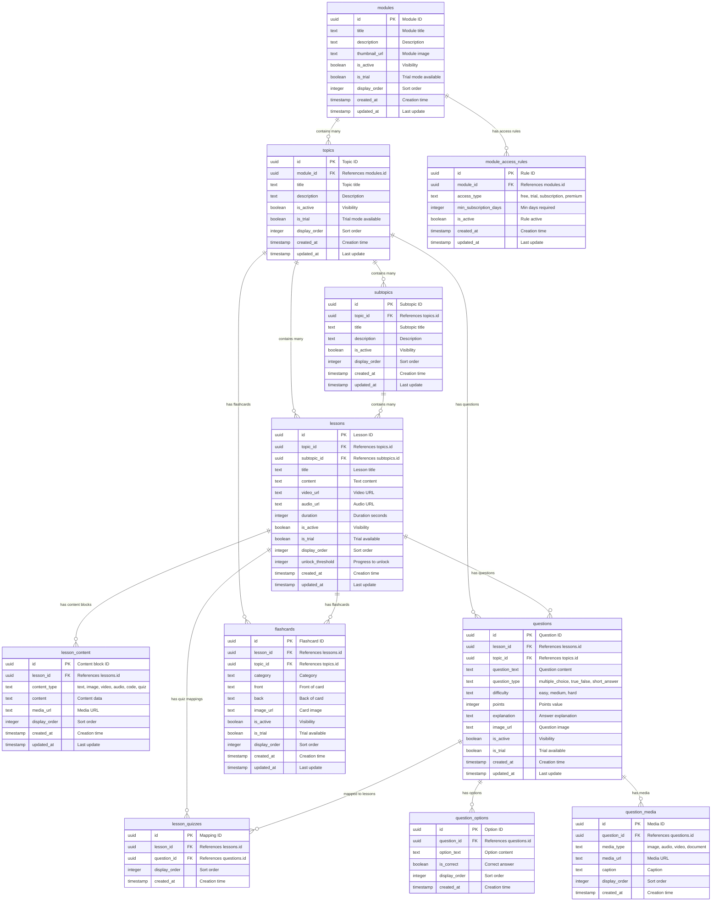

# Jeeva Learning - Entity Relationship Diagrams

## Overview

This document provides visual entity-relationship diagrams for the Jeeva Learning platform's database schema. All diagrams use Mermaid syntax for rendering and show table relationships with proper cardinality notation.

**Total Tables:** 53  
**Schema:** public  
**Diagram Notation:**
- `||--o{` : One-to-many (one required, many optional)
- `||--|{` : One-to-many (one required, many required)
- `||--||` : One-to-one
- `}o--o{` : Many-to-many

---

## Table of Contents

1. [High-Level Overview](#1-high-level-overview)
2. [Authentication & Users](#2-authentication--users)
3. [Learning Content](#3-learning-content)
4. [Progress & Practice](#4-progress--practice)
5. [Trial Module System](#5-trial-module-system)
6. [Subscriptions & Payments](#6-subscriptions--payments)
7. [Notifications](#7-notifications)
8. [AI & Chat](#8-ai--chat)
9. [System & Analytics](#9-system--analytics)

---

## 1. High-Level Overview

This diagram shows all 53 tables grouped by domain with their primary relationships.

```mermaid
erDiagram
    %% ==========================================
    %% AUTHENTICATION & USERS (5 tables)
    %% ==========================================
    users {
        uuid id PK
        text email UK
        text role
        boolean is_active
        varchar oauth_provider
    }
    user_profiles {
        uuid id PK
        uuid user_id FK
        text full_name
        text current_country
        boolean profile_completed
    }
    user_sessions {
        uuid id PK
        uuid user_id FK
        jsonb device_info
        timestamp expires_at
    }
    admin_users {
        uuid id PK
        text email UK
        text role
        boolean is_active
    }
    notification_preferences {
        uuid id PK
        uuid user_id FK
        boolean push_enabled
        boolean email_enabled
    }

    %% ==========================================
    %% LEARNING CONTENT (11 tables)
    %% ==========================================
    modules {
        uuid id PK
        text title
        boolean is_trial
        integer display_order
    }
    topics {
        uuid id PK
        uuid module_id FK
        text title
        boolean is_trial
    }
    subtopics {
        uuid id PK
        uuid topic_id FK
        text title
    }
    lessons {
        uuid id PK
        uuid topic_id FK
        uuid subtopic_id FK
        text title
        boolean is_trial
    }
    lesson_content {
        uuid id PK
        uuid lesson_id FK
        text content_type
    }
    lesson_quizzes {
        uuid id PK
        uuid lesson_id FK
        uuid question_id FK
    }
    questions {
        uuid id PK
        uuid lesson_id FK
        uuid topic_id FK
        text question_type
        text difficulty
    }
    question_options {
        uuid id PK
        uuid question_id FK
        text option_text
        boolean is_correct
    }
    question_media {
        uuid id PK
        uuid question_id FK
        text media_type
    }
    flashcards {
        uuid id PK
        uuid lesson_id FK
        uuid topic_id FK
        text front
        text back
    }
    module_access_rules {
        uuid id PK
        uuid module_id FK
        text access_type
    }

    %% ==========================================
    %% PROGRESS & PRACTICE (12 tables)
    %% ==========================================
    learning_completions {
        uuid id PK
        uuid user_id FK
        uuid lesson_id FK
        timestamp completed_at
    }
    learning_progress {
        uuid id PK
        uuid user_id FK
        uuid module_id FK
        uuid topic_id FK
        uuid subtopic_id FK
        integer progress_percent
    }
    learning_paths {
        uuid id PK
        uuid user_id FK
        jsonb path_data
    }
    lesson_quiz_results {
        uuid id PK
        uuid user_id FK
        uuid lesson_id FK
        integer score
    }
    practice_sessions {
        uuid id PK
        uuid user_id FK
        uuid topic_id FK
        text status
    }
    practice_results {
        uuid id PK
        uuid session_id FK
        uuid question_id FK
        uuid selected_option_id FK
        boolean is_correct
    }
    mock_exam_config {
        uuid id PK
        text title
        integer duration_minutes
        integer total_questions
    }
    mock_exams {
        uuid id PK
        uuid user_id FK
        uuid config_id FK
        text status
    }
    mock_results {
        uuid id PK
        uuid exam_id FK
        uuid question_id FK
        uuid selected_option_id FK
    }
    mock_sessions {
        uuid id PK
        uuid exam_id FK
        integer current_question
    }
    ai_recommendations {
        uuid id PK
        uuid user_id FK
        jsonb recommendation_data
    }
    user_analytics {
        uuid id PK
        uuid user_id FK
        jsonb analytics_data
    }

    %% ==========================================
    %% TRIAL MODULE SYSTEM (4 tables)
    %% ==========================================
    trial_mock_exams {
        uuid id PK
        uuid module_id FK
        varchar title
        uuid_array question_ids
    }
    trial_exam_attempts {
        uuid id PK
        uuid user_id FK
        uuid exam_id FK
        decimal percentage_score
    }
    trial_learning_progress {
        uuid id PK
        uuid user_id FK
        uuid topic_id FK
        uuid lesson_id FK
        boolean is_completed
    }
    trial_attempt_records {
        uuid id PK
        uuid user_id FK
        uuid module_id FK
        varchar content_type
    }

    %% ==========================================
    %% SUBSCRIPTIONS & PAYMENTS (4 tables)
    %% ==========================================
    subscription_plans {
        uuid id PK
        text name
        numeric price_usd
        integer duration_days
    }
    subscriptions {
        uuid id PK
        uuid user_id FK
        uuid plan_id FK
        text status
        text coupon_code FK
    }
    subscription_usage {
        uuid id PK
        uuid subscription_id FK
        text feature_name
        integer usage_count
    }
    discount_coupons {
        uuid id PK
        text code UK
        text discount_type
        numeric discount_value
    }

    %% ==========================================
    %% SYSTEM & SETTINGS (4 tables)
    %% ==========================================
    app_settings {
        uuid id PK
        text key UK
        text value
    }
    dashboard_hero {
        uuid id PK
        text title
        text cta_link
    }
    content_approvals {
        uuid id PK
        uuid resource_id
        text status
        uuid submitted_by FK
        uuid reviewed_by FK
    }
    email_templates {
        uuid id PK
        text name UK
        text subject
    }

    %% ==========================================
    %% AI & CHAT (3 tables)
    %% ==========================================
    chat_conversations {
        uuid id PK
        uuid user_id FK
        text title
        jsonb context_data
    }
    chat_messages {
        uuid id PK
        uuid conversation_id FK
        text role
        text content
    }
    ai_usage_stats {
        uuid id PK
        uuid user_id FK
        date date
        integer message_count
    }

    %% ==========================================
    %% NOTIFICATIONS (5 tables)
    %% ==========================================
    notifications {
        uuid id PK
        text title
        text notification_type
        uuid created_by FK
    }
    notification_queue {
        uuid id PK
        uuid notification_id FK
        uuid user_id FK
        text delivery_status
    }
    notification_targets {
        uuid id PK
        uuid notification_id FK
        uuid user_id FK
        boolean is_read
    }
    push_tokens {
        uuid id PK
        uuid user_id FK
        text token UK
        text platform
    }
    user_notification_reads {
        uuid id PK
        uuid user_id FK
        uuid notification_id FK
    }

    %% ==========================================
    %% ANALYTICS & BACKUP (5 tables)
    %% ==========================================
    analytics_sessions {
        uuid id PK
        uuid user_id FK
        timestamp session_start
    }
    daily_stats {
        uuid id PK
        date date UK
        integer total_users
        numeric revenue_usd
    }
    flashcards_backup {
        uuid id PK
        uuid lesson_id
        text front
    }
    lessons_backup {
        uuid id PK
        uuid topic_id
        text title
    }
    questions_backup {
        uuid id PK
        uuid topic_id
        text question_text
    }

    %% ==========================================
    %% RELATIONSHIPS - Authentication & Users
    %% ==========================================
    users ||--o| user_profiles : "has profile"
    users ||--o{ user_sessions : "has sessions"
    users ||--o| notification_preferences : "has preferences"

    %% ==========================================
    %% RELATIONSHIPS - Learning Content
    %% ==========================================
    modules ||--o{ topics : "contains"
    modules ||--o{ module_access_rules : "has rules"
    topics ||--o{ subtopics : "contains"
    topics ||--o{ lessons : "contains"
    topics ||--o{ questions : "has questions"
    topics ||--o{ flashcards : "has flashcards"
    subtopics ||--o{ lessons : "contains"
    lessons ||--o{ lesson_content : "has content"
    lessons ||--o{ lesson_quizzes : "has quizzes"
    lessons ||--o{ questions : "has questions"
    lessons ||--o{ flashcards : "has flashcards"
    questions ||--o{ question_options : "has options"
    questions ||--o{ question_media : "has media"
    questions ||--o{ lesson_quizzes : "in quizzes"

    %% ==========================================
    %% RELATIONSHIPS - Progress & Practice
    %% ==========================================
    users ||--o{ learning_completions : "completes"
    users ||--o{ learning_progress : "tracks"
    users ||--o{ learning_paths : "has paths"
    users ||--o{ lesson_quiz_results : "takes quizzes"
    users ||--o{ practice_sessions : "practices"
    users ||--o{ mock_exams : "takes exams"
    users ||--o{ ai_recommendations : "receives"
    users ||--o{ user_analytics : "has analytics"
    lessons ||--o{ learning_completions : "completed by"
    lessons ||--o{ lesson_quiz_results : "quiz results"
    modules ||--o{ learning_progress : "progress in"
    topics ||--o{ learning_progress : "progress in"
    topics ||--o{ practice_sessions : "practiced"
    subtopics ||--o{ learning_progress : "progress in"
    practice_sessions ||--o{ practice_results : "has results"
    questions ||--o{ practice_results : "answered in"
    question_options ||--o{ practice_results : "selected in"
    mock_exam_config ||--o{ mock_exams : "configures"
    mock_exams ||--o{ mock_results : "has results"
    mock_exams ||--o| mock_sessions : "has session"
    questions ||--o{ mock_results : "answered in"
    question_options ||--o{ mock_results : "selected in"

    %% ==========================================
    %% RELATIONSHIPS - Trial Module
    %% ==========================================
    modules ||--o{ trial_mock_exams : "has trial exams"
    modules ||--o{ trial_attempt_records : "has attempts"
    user_profiles ||--o{ trial_exam_attempts : "attempts"
    user_profiles ||--o{ trial_learning_progress : "tracks"
    user_profiles ||--o{ trial_attempt_records : "records"
    trial_mock_exams ||--o{ trial_exam_attempts : "attempted"
    topics ||--o{ trial_learning_progress : "progress in"
    lessons ||--o{ trial_learning_progress : "progress in"

    %% ==========================================
    %% RELATIONSHIPS - Subscriptions & Payments
    %% ==========================================
    users ||--o{ subscriptions : "subscribes"
    subscription_plans ||--o{ subscriptions : "purchased"
    subscriptions ||--o{ subscription_usage : "tracks usage"
    discount_coupons ||--o{ subscriptions : "applied to"

    %% ==========================================
    %% RELATIONSHIPS - AI & Chat
    %% ==========================================
    users ||--o{ chat_conversations : "has conversations"
    users ||--o{ ai_usage_stats : "usage tracked"
    chat_conversations ||--o{ chat_messages : "contains"

    %% ==========================================
    %% RELATIONSHIPS - Notifications
    %% ==========================================
    admin_users ||--o{ notifications : "creates"
    admin_users ||--o{ content_approvals : "submits"
    admin_users ||--o{ content_approvals : "reviews"
    notifications ||--o{ notification_queue : "queued"
    notifications ||--o{ notification_targets : "targets"
    notifications ||--o{ user_notification_reads : "read by"
    users ||--o{ notification_queue : "receives"
    users ||--o{ notification_targets : "targeted"
    users ||--o{ push_tokens : "has tokens"
    users ||--o{ user_notification_reads : "reads"

    %% ==========================================
    %% RELATIONSHIPS - Analytics
    %% ==========================================
    users ||--o{ analytics_sessions : "has sessions"
```




---

## 2. Authentication & Users

This diagram shows the 5 tables related to user authentication and profile management.

```mermaid
erDiagram
    users {
        uuid id PK "Primary key"
        text email UK "Unique email address"
        text role "User role (default: student)"
        boolean is_active "Account status"
        varchar(20) oauth_provider "email, google, apple"
        text oauth_id "OAuth provider user ID"
        timestamp created_at "Account creation time"
        timestamp updated_at "Last update time"
    }

    user_profiles {
        uuid id PK "Profile ID"
        uuid user_id FK "References users.id"
        text full_name "User's full name"
        text phone_number "Contact number"
        text country_code "Phone country code"
        date date_of_birth "Birth date"
        text gender "Gender"
        text current_country "For payment routing"
        integer nmc_attempts "NMC CBT exam attempts"
        boolean uses_coaching "Attending coaching"
        text nursing_id_url "License upload URL"
        boolean profile_completed "Onboarding complete"
        timestamp created_at "Creation time"
        timestamp updated_at "Last update"
    }

    user_sessions {
        uuid id PK "Session ID"
        uuid user_id FK "References users.id"
        jsonb device_info "Device metadata"
        text ip_address "Client IP"
        timestamp last_active "Last activity"
        timestamp created_at "Session start"
        timestamp expires_at "Session expiry"
    }

    admin_users {
        uuid id PK "Admin user ID"
        text email UK "Admin email"
        text full_name "Admin name"
        text role "superadmin, editor, moderator"
        boolean is_active "Account status"
        timestamp created_at "Creation time"
        timestamp updated_at "Last update"
    }

    notification_preferences {
        uuid id PK "Preference ID"
        uuid user_id FK UK "References users.id"
        boolean push_enabled "Push notifications"
        boolean email_enabled "Email notifications"
        boolean study_reminders "Study reminders"
        boolean progress_updates "Progress updates"
        boolean promotional "Promotional"
        timestamp created_at "Creation time"
        timestamp updated_at "Last update"
    }

    %% Relationships with cardinality
    users ||--o| user_profiles : "has one profile"
    users ||--o{ user_sessions : "has many sessions"
    users ||--o| notification_preferences : "has one preference set"
```

**Relationship Details:**

| Parent Table | Child Table | Cardinality | ON DELETE | Description |
|--------------|-------------|-------------|-----------|-------------|
| users | user_profiles | 1:1 | CASCADE | Each user has exactly one profile |
| users | user_sessions | 1:N | CASCADE | Each user can have multiple active sessions |
| users | notification_preferences | 1:1 | CASCADE | Each user has one preference record |

---

## 3. Learning Content

This diagram shows the 11 tables that store learning content including modules, topics, lessons, questions, and flashcards.



**Relationship Details:**

| Parent Table | Child Table | Cardinality | ON DELETE | Description |
|--------------|-------------|-------------|-----------|-------------|
| modules | topics | 1:N | CASCADE | Module contains many topics |
| modules | module_access_rules | 1:N | CASCADE | Module has access rules |
| topics | subtopics | 1:N | CASCADE | Topic contains subtopics |
| topics | lessons | 1:N | CASCADE | Topic contains lessons |
| topics | questions | 1:N | SET NULL | Topic has questions |
| topics | flashcards | 1:N | SET NULL | Topic has flashcards |
| subtopics | lessons | 1:N | SET NULL | Subtopic contains lessons |
| lessons | lesson_content | 1:N | CASCADE | Lesson has content blocks |
| lessons | lesson_quizzes | 1:N | CASCADE | Lesson has quiz mappings |
| lessons | questions | 1:N | SET NULL | Lesson has questions |
| lessons | flashcards | 1:N | CASCADE | Lesson has flashcards |
| questions | question_options | 1:N | CASCADE | Question has options |
| questions | question_media | 1:N | CASCADE | Question has media |
| questions | lesson_quizzes | 1:N | CASCADE | Question in quizzes |


---

## 4. Progress & Practice

This diagram shows the 12 tables that track user learning progress, practice sessions, and mock exams.

```mermaid
erDiagram
    users {
        uuid id PK "User ID"
    }

    lessons {
        uuid id PK "Lesson ID"
    }

    modules {
        uuid id PK "Module ID"
    }

    topics {
        uuid id PK "Topic ID"
    }

    subtopics {
        uuid id PK "Subtopic ID"
    }

    questions {
        uuid id PK "Question ID"
    }

    question_options {
        uuid id PK "Option ID"
    }

    learning_completions {
        uuid id PK "Completion ID"
        uuid user_id FK "References users.id"
        uuid lesson_id FK "References lessons.id"
        timestamp completed_at "Completion time"
    }

    learning_progress {
        uuid id PK "Progress ID"
        uuid user_id FK "References users.id"
        uuid module_id FK "References modules.id"
        uuid topic_id FK "References topics.id"
        uuid subtopic_id FK "References subtopics.id"
        integer progress_percent "Progress percentage"
        text status "not_started, in_progress, completed"
        timestamp last_accessed "Last access"
        timestamp created_at "Creation time"
        timestamp updated_at "Last update"
    }

    learning_paths {
        uuid id PK "Path ID"
        uuid user_id FK "References users.id"
        jsonb path_data "Path configuration"
        boolean is_active "Active status"
        timestamp created_at "Creation time"
        timestamp updated_at "Last update"
    }

    lesson_quiz_results {
        uuid id PK "Result ID"
        uuid user_id FK "References users.id"
        uuid lesson_id FK "References lessons.id"
        integer score "Quiz score"
        integer total_questions "Total questions"
        integer correct_answers "Correct count"
        integer time_taken "Time in seconds"
        jsonb answers_data "Detailed answers"
        timestamp created_at "Attempt time"
    }

    practice_sessions {
        uuid id PK "Session ID"
        uuid user_id FK "References users.id"
        uuid topic_id FK "References topics.id"
        text session_type "Type of session"
        text status "in_progress, completed, abandoned"
        timestamp created_at "Session start"
        timestamp updated_at "Last update"
        timestamp completed_at "Session end"
    }

    practice_results {
        uuid id PK "Result ID"
        uuid session_id FK "References practice_sessions.id"
        uuid question_id FK "References questions.id"
        uuid selected_option_id FK "References question_options.id"
        boolean is_correct "Answer correctness"
        integer time_taken "Time in seconds"
        jsonb answer_log "Detailed log"
        timestamp created_at "Answer time"
    }

    mock_exam_config {
        uuid id PK "Config ID"
        text title "Exam title"
        text description "Description"
        integer duration_minutes "Duration"
        integer total_questions "Question count"
        integer passing_score "Passing percentage"
        uuid_array topic_ids "Topics to include"
        jsonb difficulty_distribution "Difficulty mix"
        boolean is_active "Active status"
        timestamp created_at "Creation time"
        timestamp updated_at "Last update"
    }

    mock_exams {
        uuid id PK "Exam ID"
        uuid user_id FK "References users.id"
        uuid config_id FK "References mock_exam_config.id"
        jsonb exam_data "Exam configuration"
        text status "in_progress, completed, abandoned, timed_out"
        timestamp started_at "Start time"
        timestamp completed_at "End time"
        timestamp created_at "Creation time"
    }

    mock_results {
        uuid id PK "Result ID"
        uuid exam_id FK "References mock_exams.id"
        uuid question_id FK "References questions.id"
        uuid selected_option_id FK "References question_options.id"
        boolean is_correct "Answer correctness"
        integer time_taken "Time in seconds"
        jsonb results_data "Detailed results"
        timestamp created_at "Answer time"
    }

    mock_sessions {
        uuid id PK "Session ID"
        uuid exam_id FK "References mock_exams.id"
        integer current_question "Current index"
        integer time_remaining "Remaining seconds"
        timestamp last_activity "Last activity"
        timestamp created_at "Session start"
    }

    ai_recommendations {
        uuid id PK "Recommendation ID"
        uuid user_id FK "References users.id"
        text recommendation_type "Type"
        jsonb recommendation_data "AI suggestion"
        boolean is_dismissed "Dismissed flag"
        timestamp created_at "Creation time"
        timestamp expires_at "Expiry time"
    }

    user_analytics {
        uuid id PK "Analytics ID"
        uuid user_id FK "References users.id"
        jsonb analytics_data "Metrics data"
        date period_start "Period start"
        date period_end "Period end"
        timestamp created_at "Record time"
        timestamp updated_at "Last update"
    }

    %% User progress relationships
    users ||--o{ learning_completions : "completes lessons"
    users ||--o{ learning_progress : "tracks progress"
    users ||--o{ learning_paths : "has learning paths"
    users ||--o{ lesson_quiz_results : "takes quizzes"
    users ||--o{ practice_sessions : "has practice sessions"
    users ||--o{ mock_exams : "takes mock exams"
    users ||--o{ ai_recommendations : "receives recommendations"
    users ||--o{ user_analytics : "has analytics"

    %% Content relationships
    lessons ||--o{ learning_completions : "completed by users"
    lessons ||--o{ lesson_quiz_results : "quiz results"
    modules ||--o{ learning_progress : "progress tracked"
    topics ||--o{ learning_progress : "progress tracked"
    topics ||--o{ practice_sessions : "practiced in"
    subtopics ||--o{ learning_progress : "progress tracked"

    %% Practice relationships
    practice_sessions ||--o{ practice_results : "has results"
    questions ||--o{ practice_results : "answered in practice"
    question_options ||--o{ practice_results : "selected in practice"

    %% Mock exam relationships
    mock_exam_config ||--o{ mock_exams : "configures exams"
    mock_exams ||--o{ mock_results : "has results"
    mock_exams ||--o| mock_sessions : "has active session"
    questions ||--o{ mock_results : "answered in mock"
    question_options ||--o{ mock_results : "selected in mock"
```



**Relationship Details:**

| Parent Table | Child Table | Cardinality | ON DELETE | Description |
|--------------|-------------|-------------|-----------|-------------|
| users | learning_completions | 1:N | CASCADE | User completes many lessons |
| users | learning_progress | 1:N | CASCADE | User has progress records |
| users | learning_paths | 1:N | CASCADE | User has learning paths |
| users | lesson_quiz_results | 1:N | CASCADE | User takes many quizzes |
| users | practice_sessions | 1:N | CASCADE | User has practice sessions |
| users | mock_exams | 1:N | CASCADE | User takes mock exams |
| users | ai_recommendations | 1:N | CASCADE | User receives recommendations |
| users | user_analytics | 1:N | CASCADE | User has analytics |
| lessons | learning_completions | 1:N | CASCADE | Lesson completed by users |
| lessons | lesson_quiz_results | 1:N | CASCADE | Lesson has quiz results |
| modules | learning_progress | 1:N | CASCADE | Module progress tracked |
| topics | learning_progress | 1:N | CASCADE | Topic progress tracked |
| topics | practice_sessions | 1:N | SET NULL | Topic practiced |
| subtopics | learning_progress | 1:N | CASCADE | Subtopic progress tracked |
| practice_sessions | practice_results | 1:N | CASCADE | Session has results |
| questions | practice_results | 1:N | SET NULL | Question answered |
| question_options | practice_results | 1:N | SET NULL | Option selected |
| mock_exam_config | mock_exams | 1:N | SET NULL | Config creates exams |
| mock_exams | mock_results | 1:N | CASCADE | Exam has results |
| mock_exams | mock_sessions | 1:1 | CASCADE | Exam has session |
| questions | mock_results | 1:N | SET NULL | Question answered |
| question_options | mock_results | 1:N | SET NULL | Option selected |

---

## 5. Trial Module System

This diagram shows the 4 tables specific to the trial module functionality.

```mermaid
erDiagram
    user_profiles {
        uuid id PK "Profile ID"
    }

    modules {
        uuid id PK "Module ID"
    }

    topics {
        uuid id PK "Topic ID"
    }

    lessons {
        uuid id PK "Lesson ID"
    }

    trial_mock_exams {
        uuid id PK "Exam ID"
        uuid module_id FK "References modules.id"
        varchar(255) title "Exam title"
        text description "Description"
        integer question_count "Number of questions"
        integer time_limit_minutes "Duration"
        integer passing_score "Passing percentage"
        uuid_array question_ids "Question UUIDs array"
        boolean allow_mark_for_review "Allow review marking"
        boolean allow_answer_changes "Allow changes"
        boolean show_question_navigator "Show navigator"
        boolean auto_submit_at_time_limit "Auto submit"
        boolean show_results_immediately "Show results"
        boolean is_active "Active status"
        timestamptz created_at "Creation time"
        timestamptz updated_at "Last update"
    }

    trial_exam_attempts {
        uuid id PK "Attempt ID"
        uuid user_id FK UK "References user_profiles.id"
        uuid exam_id FK UK "References trial_mock_exams.id"
        integer total_questions "Total questions"
        integer correct_answers "Correct count"
        integer incorrect_answers "Incorrect count"
        decimal score "Raw score"
        decimal percentage_score "Percentage"
        boolean is_passed "Passed flag"
        jsonb user_answers "User answers"
        jsonb marked_for_review "Review marks"
        timestamptz started_at "Start time"
        timestamptz completed_at "End time"
        integer duration_seconds "Duration"
        jsonb topic_scores "Topic breakdown"
        varchar(50) status "in_progress, completed, abandoned"
        varchar(50) device_type "Device used"
        timestamptz created_at "Creation time"
        timestamptz updated_at "Last update"
    }

    trial_learning_progress {
        uuid id PK "Progress ID"
        uuid user_id FK UK "References user_profiles.id"
        uuid topic_id FK "References topics.id"
        uuid lesson_id FK UK "References lessons.id"
        boolean is_started "Started flag"
        boolean is_completed "Completed flag"
        boolean is_unlocked "Unlocked flag"
        integer assessment_score "Assessment score"
        decimal assessment_percentage "Assessment percentage"
        boolean assessment_passed "Assessment passed"
        integer assessment_attempts "Attempt count"
        jsonb content_viewed "Content viewed"
        integer estimated_time_spent_minutes "Time spent"
        timestamptz started_at "Start time"
        timestamptz completed_at "Completion time"
        timestamptz last_accessed_at "Last access"
        timestamptz created_at "Creation time"
        timestamptz updated_at "Last update"
    }

    trial_attempt_records {
        uuid id PK "Record ID"
        uuid user_id FK "References user_profiles.id"
        uuid module_id FK "References modules.id"
        varchar(50) content_type "practice, learning, mock_exam"
        varchar(100) section_type "Section identifier"
        integer total_questions "Total questions"
        integer correct_answers "Correct count"
        integer score "Raw score"
        decimal percentage_score "Percentage"
        timestamptz started_at "Start time"
        timestamptz completed_at "End time"
        integer duration_seconds "Duration"
        boolean is_passed "Passed flag"
        varchar(50) status "in_progress, completed, abandoned"
        jsonb answers_data "Answers data"
        jsonb question_details "Question details"
        varchar(50) device_type "Device used"
        timestamptz created_at "Creation time"
        timestamptz updated_at "Last update"
    }

    %% Module relationships
    modules ||--o{ trial_mock_exams : "has trial exams"
    modules ||--o{ trial_attempt_records : "has attempt records"

    %% User profile relationships
    user_profiles ||--o{ trial_exam_attempts : "attempts exams"
    user_profiles ||--o{ trial_learning_progress : "tracks progress"
    user_profiles ||--o{ trial_attempt_records : "has records"

    %% Exam relationships
    trial_mock_exams ||--o{ trial_exam_attempts : "attempted by users"

    %% Content relationships
    topics ||--o{ trial_learning_progress : "progress tracked"
    lessons ||--o{ trial_learning_progress : "progress tracked"
```

**Relationship Details:**

| Parent Table | Child Table | Cardinality | ON DELETE | Description |
|--------------|-------------|-------------|-----------|-------------|
| modules | trial_mock_exams | 1:N | CASCADE | Module has trial exams |
| modules | trial_attempt_records | 1:N | CASCADE | Module has attempt records |
| user_profiles | trial_exam_attempts | 1:N | CASCADE | User attempts exams |
| user_profiles | trial_learning_progress | 1:N | CASCADE | User tracks progress |
| user_profiles | trial_attempt_records | 1:N | CASCADE | User has records |
| trial_mock_exams | trial_exam_attempts | 1:N | CASCADE | Exam has attempts |
| topics | trial_learning_progress | 1:N | CASCADE | Topic progress tracked |
| lessons | trial_learning_progress | 1:N | CASCADE | Lesson progress tracked |

**Note:** Trial tables reference `user_profiles.id` instead of `users.id` for user identification.


---

## 6. Subscriptions & Payments

This diagram shows the 4 tables that manage subscription plans, user subscriptions, and discount coupons.

```mermaid
erDiagram
    users {
        uuid id PK "User ID"
    }

    subscription_plans {
        uuid id PK "Plan ID"
        text name "Plan name"
        text description "Description"
        numeric price_usd "Price in USD"
        numeric price_inr "Price in INR"
        numeric price_gbp "Price in GBP"
        integer duration_days "Access duration"
        text_array features "Feature list"
        boolean is_active "Availability"
        boolean is_trial "Trial plan flag"
        integer display_order "Sort order"
        timestamp created_at "Creation time"
        timestamp updated_at "Last update"
    }

    subscriptions {
        uuid id PK "Subscription ID"
        uuid user_id FK "References users.id"
        uuid plan_id FK "References subscription_plans.id"
        text status "trial, active, expired, cancelled, pending"
        timestamp start_date "Start date"
        timestamp end_date "End date"
        text payment_gateway "stripe, razorpay"
        text payment_method "Payment type"
        numeric amount_paid_usd "Amount in USD"
        numeric amount_paid_local "Local currency amount"
        text currency "Currency code"
        text coupon_code FK "References discount_coupons.code"
        numeric discount_amount "Discount applied"
        text transaction_id "Payment transaction ID"
        text stripe_subscription_id "Stripe ID"
        text razorpay_subscription_id "Razorpay ID"
        timestamp created_at "Creation time"
        timestamp updated_at "Last update"
    }

    subscription_usage {
        uuid id PK "Usage ID"
        uuid subscription_id FK UK "References subscriptions.id"
        text feature_name UK "Feature identifier"
        integer usage_count "Usage count"
        integer usage_limit "Usage limit"
        timestamp last_used "Last usage"
        timestamp created_at "Creation time"
        timestamp updated_at "Last update"
    }

    discount_coupons {
        uuid id PK "Coupon ID"
        text code UK "Coupon code"
        text description "Description"
        text discount_type "percentage, fixed_amount"
        numeric discount_value "Discount amount"
        uuid_array applicable_plans "Plan IDs (null = all)"
        integer usage_limit "Max redemptions"
        integer usage_count "Times used"
        timestamp valid_from "Start date"
        timestamp valid_until "Expiry date"
        boolean is_active "Active status"
        timestamp created_at "Creation time"
        timestamp updated_at "Last update"
    }

    %% User subscription relationships
    users ||--o{ subscriptions : "has subscriptions"

    %% Plan relationships
    subscription_plans ||--o{ subscriptions : "purchased as"

    %% Subscription tracking
    subscriptions ||--o{ subscription_usage : "tracks usage"

    %% Coupon relationships
    discount_coupons ||--o{ subscriptions : "applied to"
```

**Relationship Details:**

| Parent Table | Child Table | Cardinality | ON DELETE | Description |
|--------------|-------------|-------------|-----------|-------------|
| users | subscriptions | 1:N | CASCADE | User has subscriptions |
| subscription_plans | subscriptions | 1:N | RESTRICT | Plan purchased by users |
| subscriptions | subscription_usage | 1:N | CASCADE | Subscription tracks usage |
| discount_coupons | subscriptions | 1:N | SET NULL | Coupon applied to subscriptions |

**Trigger:** `increment_coupon_on_subscription` → `increment_coupon_usage` - Automatically increments coupon usage count when a subscription is created with a coupon code.

---

## 7. Notifications

This diagram shows the 5 tables that manage push notifications, in-app notifications, and delivery tracking.

```mermaid
erDiagram
    users {
        uuid id PK "User ID"
    }

    admin_users {
        uuid id PK "Admin ID"
    }

    notifications {
        uuid id PK "Notification ID"
        text title "Title"
        text body "Body"
        text notification_type "announcement, reminder, achievement, promotional, system"
        jsonb data "Additional data"
        text image_url "Image URL"
        text action_url "Action link"
        boolean is_active "Active status"
        timestamp scheduled_at "Scheduled time"
        uuid created_by FK "References admin_users.id"
        timestamp created_at "Creation time"
        timestamp updated_at "Last update"
    }

    notification_queue {
        uuid id PK "Queue ID"
        uuid notification_id FK "References notifications.id"
        uuid user_id FK "References users.id"
        text delivery_status "pending, sent, delivered, failed, cancelled"
        text delivery_channel "push, email, in_app"
        integer attempts "Delivery attempts"
        timestamp last_attempt "Last attempt time"
        timestamp delivered_at "Delivery time"
        text error_message "Error details"
        timestamp created_at "Creation time"
        timestamp updated_at "Last update"
    }

    notification_targets {
        uuid id PK "Target ID"
        uuid notification_id FK UK "References notifications.id"
        uuid user_id FK UK "References users.id"
        boolean is_read "Read status"
        timestamp read_at "Read time"
        boolean is_dismissed "Dismissed status"
        timestamp created_at "Creation time"
        timestamp updated_at "Last update"
    }

    push_tokens {
        uuid id PK "Token ID"
        uuid user_id FK "References users.id"
        text token UK "Push token"
        text platform "ios, android, web"
        jsonb device_info "Device metadata"
        boolean is_active "Token active"
        timestamp last_used "Last usage"
        timestamp created_at "Creation time"
        timestamp updated_at "Last update"
    }

    user_notification_reads {
        uuid id PK "Read ID"
        uuid user_id FK UK "References users.id"
        uuid notification_id FK UK "References notifications.id"
        timestamp read_at "Read time"
        timestamp created_at "Creation time"
    }

    %% Admin creates notifications
    admin_users ||--o{ notifications : "creates"

    %% Notification delivery
    notifications ||--o{ notification_queue : "queued for delivery"
    notifications ||--o{ notification_targets : "targets users"
    notifications ||--o{ user_notification_reads : "read by users"

    %% User relationships
    users ||--o{ notification_queue : "receives notifications"
    users ||--o{ notification_targets : "targeted by"
    users ||--o{ push_tokens : "has device tokens"
    users ||--o{ user_notification_reads : "reads notifications"
```

**Relationship Details:**

| Parent Table | Child Table | Cardinality | ON DELETE | Description |
|--------------|-------------|-------------|-----------|-------------|
| admin_users | notifications | 1:N | SET NULL | Admin creates notifications |
| notifications | notification_queue | 1:N | CASCADE | Notification queued for delivery |
| notifications | notification_targets | 1:N | CASCADE | Notification targets users |
| notifications | user_notification_reads | 1:N | CASCADE | Notification read by users |
| users | notification_queue | 1:N | CASCADE | User receives notifications |
| users | notification_targets | 1:N | CASCADE | User targeted by notifications |
| users | push_tokens | 1:N | CASCADE | User has device tokens |
| users | user_notification_reads | 1:N | CASCADE | User reads notifications |

**Triggers:**
- `notifications_updated_at` → `update_notifications_updated_at`
- `notification_queue_updated_at` → `update_notification_queue_updated_at`
- `notification_targets_updated_at` → `update_notification_targets_updated_at`
- `push_tokens_updated_at` → `update_push_tokens_updated_at`

---

## 8. AI & Chat

This diagram shows the 3 tables that manage AI chatbot conversations and usage tracking.

```mermaid
erDiagram
    users {
        uuid id PK "User ID"
    }

    chat_conversations {
        uuid id PK "Conversation ID"
        uuid user_id FK "References users.id"
        text title "Conversation title"
        jsonb context_data "User context for AI"
        boolean is_archived "Archive status"
        timestamp created_at "Creation time"
        timestamp updated_at "Last update"
    }

    chat_messages {
        uuid id PK "Message ID"
        uuid conversation_id FK "References chat_conversations.id"
        text role "user, assistant"
        text content "Message text"
        jsonb metadata "AI metadata"
        timestamp created_at "Creation time"
    }

    ai_usage_stats {
        uuid id PK "Stat ID"
        uuid user_id FK UK "References users.id"
        date date UK "Usage date"
        integer message_count "Messages sent"
        integer total_tokens "Tokens consumed"
        timestamp created_at "Creation time"
        timestamp updated_at "Last update"
    }

    %% User relationships
    users ||--o{ chat_conversations : "has conversations"
    users ||--o{ ai_usage_stats : "usage tracked"

    %% Conversation relationships
    chat_conversations ||--o{ chat_messages : "contains messages"
```

**Relationship Details:**

| Parent Table | Child Table | Cardinality | ON DELETE | Description |
|--------------|-------------|-------------|-----------|-------------|
| users | chat_conversations | 1:N | CASCADE | User has conversations |
| users | ai_usage_stats | 1:N | CASCADE | User usage tracked |
| chat_conversations | chat_messages | 1:N | CASCADE | Conversation has messages |

**Triggers:**
- `chat_conversation_updated_at` → `update_chat_conversation_timestamp`
- `ai_usage_updated_at` → `update_ai_usage_timestamp`

**JSONB Structures:**

`context_data` (chat_conversations):
```json
{
  "currentLesson": {
    "id": "uuid",
    "title": "Introduction to Clinical Skills",
    "moduleId": "uuid"
  },
  "userLevel": "intermediate",
  "recentTopics": ["clinical-skills", "patient-care"]
}
```

`metadata` (chat_messages):
```json
{
  "model": "gemini-1.5-flash",
  "tokensUsed": 245,
  "responseTime": 1.2,
  "confidenceScore": 0.87
}
```

---

## 9. System & Analytics

This diagram shows the system settings, content approvals, and analytics tables.

```mermaid
erDiagram
    admin_users {
        uuid id PK "Admin ID"
    }

    users {
        uuid id PK "User ID"
    }

    app_settings {
        uuid id PK "Setting ID"
        text key UK "Setting key"
        text value "Setting value"
        text description "Description"
        timestamp created_at "Creation time"
        timestamp updated_at "Last update"
    }

    dashboard_hero {
        uuid id PK "Hero ID"
        text title "Hero title"
        text subtitle "Subtitle"
        text image_url "Banner image"
        text background_color "Background hex"
        text text_color "Text hex"
        text cta_text "CTA button text"
        text cta_link "CTA destination"
        boolean is_active "Visibility"
        integer display_order "Sort order"
        timestamp created_at "Creation time"
        timestamp updated_at "Last update"
    }

    content_approvals {
        uuid id PK "Approval ID"
        uuid resource_id "Content ID"
        text resource_type "module, topic, lesson, question, flashcard"
        text resource_title "Content title"
        text status "pending, approved, rejected"
        uuid submitted_by FK "References admin_users.id"
        uuid reviewed_by FK "References admin_users.id"
        text review_comments "Review notes"
        timestamp created_at "Submission time"
        timestamp updated_at "Last update"
        timestamp reviewed_at "Review time"
    }

    email_templates {
        uuid id PK "Template ID"
        text name UK "Template name"
        text subject "Email subject"
        text body "HTML content"
        text_array variables "Template variables"
        boolean is_active "Active status"
        timestamp created_at "Creation time"
        timestamp updated_at "Last update"
    }

    analytics_sessions {
        uuid id PK "Session ID"
        uuid user_id FK "References users.id"
        timestamp session_start "Session start"
        timestamp session_end "Session end"
        integer duration_seconds "Duration"
        jsonb device_info "Device metadata"
        text ip_address "Client IP"
        text user_agent "Browser info"
        timestamp created_at "Creation time"
    }

    daily_stats {
        uuid id PK "Stat ID"
        date date UK "Stats date"
        integer total_users "Total users"
        integer active_users "Active users"
        integer new_users "New registrations"
        integer lessons_completed "Lessons completed"
        integer practice_sessions "Practice sessions"
        integer mock_exams_taken "Mock exams"
        integer subscriptions_created "New subscriptions"
        numeric revenue_usd "Revenue USD"
        timestamp created_at "Creation time"
        timestamp updated_at "Last update"
    }

    flashcards_backup {
        uuid id PK "Original ID"
        uuid lesson_id "Lesson reference"
        uuid topic_id "Topic reference"
        text category "Category"
        text front "Front"
        text back "Back"
        timestamp backed_up_at "Backup time"
    }

    lessons_backup {
        uuid id PK "Original ID"
        uuid topic_id "Topic reference"
        uuid subtopic_id "Subtopic reference"
        text title "Title"
        timestamp backed_up_at "Backup time"
    }

    questions_backup {
        uuid id PK "Original ID"
        uuid lesson_id "Lesson reference"
        uuid topic_id "Topic reference"
        text question_text "Question"
        timestamp backed_up_at "Backup time"
    }

    %% Admin relationships
    admin_users ||--o{ content_approvals : "submits content"
    admin_users ||--o{ content_approvals : "reviews content"

    %% User analytics
    users ||--o{ analytics_sessions : "has sessions"
```



**Relationship Details:**

| Parent Table | Child Table | Cardinality | ON DELETE | Description |
|--------------|-------------|-------------|-----------|-------------|
| admin_users | content_approvals (submitted_by) | 1:N | SET NULL | Admin submits content |
| admin_users | content_approvals (reviewed_by) | 1:N | SET NULL | Admin reviews content |
| users | analytics_sessions | 1:N | SET NULL | User has sessions |

**Standalone Tables (No Foreign Keys):**
- `app_settings` - Application configuration key-value pairs
- `dashboard_hero` - Mobile app dashboard banners
- `email_templates` - Email template storage
- `daily_stats` - Aggregated daily metrics
- `flashcards_backup` - Flashcard backup data
- `lessons_backup` - Lesson backup data
- `questions_backup` - Question backup data

**Trigger:**
- `content_approvals_updated_at` → `update_content_approvals_updated_at`

---

## Cardinality Reference

### Notation Guide

| Symbol | Meaning | Example |
|--------|---------|---------|
| `\|\|--o{` | One (required) to Many (optional) | One user has zero or more sessions |
| `\|\|--\|{` | One (required) to Many (required) | One order has one or more items |
| `\|\|--o\|` | One (required) to One (optional) | One user has zero or one profile |
| `\|\|--\|\|` | One (required) to One (required) | One person has exactly one passport |
| `}o--o{` | Many (optional) to Many (optional) | Students and courses (via junction) |

### Cardinality Summary by Domain

| Domain | 1:1 Relationships | 1:N Relationships | Notes |
|--------|-------------------|-------------------|-------|
| Auth & Users | 2 | 1 | user_profiles, notification_preferences are 1:1 |
| Learning Content | 0 | 14 | Hierarchical structure |
| Progress & Practice | 1 | 21 | mock_sessions is 1:1 with mock_exams |
| Trial Module | 0 | 8 | All 1:N relationships |
| Subscriptions | 0 | 4 | All 1:N relationships |
| Notifications | 0 | 8 | All 1:N relationships |
| AI & Chat | 0 | 3 | All 1:N relationships |
| System & Analytics | 0 | 3 | Mostly standalone tables |

### Foreign Key ON DELETE Behaviors

| Behavior | Count | Usage |
|----------|-------|-------|
| CASCADE | 52 | Most relationships - delete children when parent deleted |
| SET NULL | 12 | Optional relationships - set to NULL when parent deleted |
| RESTRICT | 1 | subscription_plans → subscriptions - prevent deletion |

